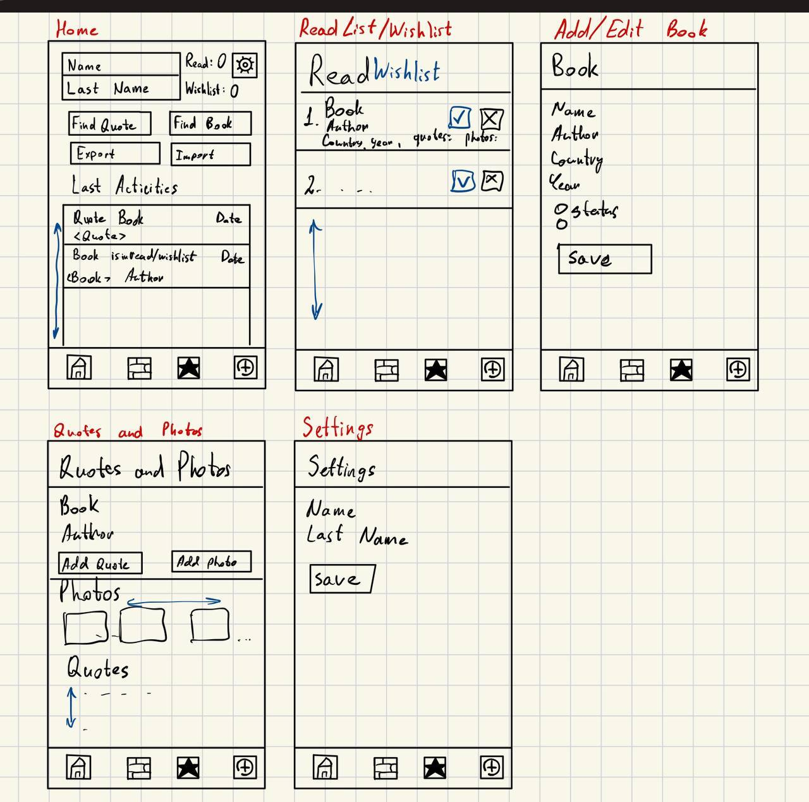

# Blesbook

**Research Seminar "Basics of Android Development" | Project**

Author: Alexander Vasyukov

## Description of project

This project is an Android app for managing of books and quotes, written in Kotlin.

### Home

- User Information: First name, last name, number of books read, and number of books in the wishlist
- Settings Button: Edit the user's name, and export or import data using JSON format
- Find Quote Button
- Find Book or Author Button
- News List

### Books

This screen displays a list of books read by the user.

Each item includes:
- Title
- Author
- Country
- Year
- Number of quotes

Long-pressing an item opens a dialog window, allowing the user to delete or edit the book.

### Wishlist

Similar to the Books screen, but it hascontains books the user wants to read. There is also there is a button to mark that a book is read.

### Add Book

A screen for adding new books.

It includes 4 fields and a status selection:
- Title
- Author
- Country
- Year
- Status: Read / Wishlist

### Book

Every book has its own screen displaying detailed information (main information, quotes, and photos) and 2 buttons:
- Add quote
- Add photo

Long-pressing a quote allows the user to edit or delete it.

Users can tap a photo to view it in full-screen mode. Long-pressing a photo provides the option to delete it.

### Find Quote

This screen contains a search bar where users can input a quote. The results are displayed below. If no quotes are found, a corresponding message is shown.

### Find Book or Author

Similar to the Find Quote screen, but for searching books and authors. Users can search within books, authors, or both.

## For the Future

0. Update book edit (it updates, but the old version stays too)
1. Add user account -> Data Base or cloud storage
2. Subscriptions -> Notifications
3. Edit Search screen (the problem with keyboard because of the use of Recyclerview, maybe)
4. Archive of books
5. List of authors -> Author Page
6. CSV, XML, YAML import and export 
7. Share a book
8. Update design
9. Update fields for the added book (now all words start with an uppercase letter)
10. Use a stack for news and books instead a queue